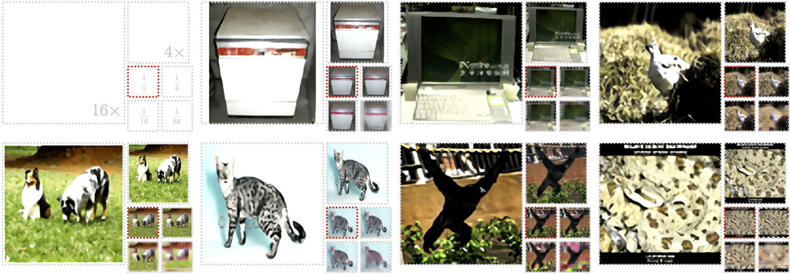

# Neural Wavelet Flow

This repo provides the **original code** for the paper *Learning Non-linear Wavelet Transformation via Normalizing Flow* ([arXiv:XXXX.XXXXX](https://arxiv.org/)). See a lite and cleaner version of implementation at the [lite branch](https://github.com/li012589/NeuralWavelet).

## Intro

Wavelet transformation stands as a cornerstone in modern data analysis and signal processing. Its mathematical essence is an invertible transformation that discerns slow patterns from fast patterns in the frequency domain, which repeats at each level. Such an invertible transformation can be learned by a designed normalizing flow model. With a factor-out scheme resembling the wavelet downsampling mechanism, a mutually independent prior, and parameter sharing along the depth of the network, one can train normalizing flow models to factor-out variables corresponding to fast patterns at different levels, thus extending linear wavelet transformations to non-linear learnable models. In this work, a concrete way of building such flows is given. Then, a demonstration of the model’s ability in lossless compression task, progressive loading, and super-resolution (upsampling) task. Lastly, an analysis of the learned model in terms of low-pass/high-pass filters is given.

## Results

### Wavelet Transformation Plot


### Compression Scores

Table 1. Lossless compression scores(bits per dimension) on CIFAR-10, ImageNet32, ImageNet64.

|             | CIFAR       | ImageNet32  | ImageNet64  |
| ----------- | ----------- | ----------- | ----------- |
| NWF         | 3.59 (3.58) | 4.02 (4.01) | 3.74 (3.73) |
| NWF(in YCC) | 3.14 (3.12) | 3.53 (3.51) | 3.24 (3.24) |

Table 2. Compression scores on different datasets than trained on. Scores are actual achieved BPDs.

| Eval. on\Train on | ImageNet32 | ImageNet64 |
| ----------------- | ---------- | ---------- |
| ImageNet32        | 4.04       | 4.05       |
| ImageNet64        | 3.77       | 3.74       |

### Progressive Loading & Super-resolution 

Figure 1. Progressive loading from 1/64, 1/16, and 1/4 original size back to the original size. And super-resolution of original images to 4× and 16× size. The layout is diagramed in the first plot. The images marked with red are the original images. The original images are from ImageNet64, and the model is trained on it.

### 

### FIR Plot

Figure 2. Plot (a) and (b) are frequency responses of learned low-pass filters and high-pass filters, respectively.


## Usage

```shell
# train
python ./main.py -cuda 0 -epoch 600 -hchnl 350 -repeat 3 -nhidden 3 -target ImageNet32
```

```shell
# Flow model compress method
python ./encode.py -batch 10 -earlyStop 5 -folder /Users/lili/Documents/MySpace/NeoNWL/opt/reoder/default_easyMera_ImageNet32_simplePrior_False_repeat_3_hchnl_350_nhidden_3_nMixing_5_sameDetail_True_clamp_-1_62efb58d8de7b1c7587776b9cb53cac2c741244a
```

```shell
# Flow model migrate compress method
python ./encode.py -batch 10 -earlyStop 5 -target ImageNet64 -folder /Users/lili/Documents/MySpace/NeoNWL/opt/reoder/default_easyMera_ImageNet32_simplePrior_False_repeat_3_hchnl_350_nhidden_3_nMixing_5_sameDetail_True_clamp_-1_62efb58d8de7b1c7587776b9cb53cac2c741244a
```

```shell
# plot inplot of wavelet
python ./waveletPlot.py -img ./etc/lena512color.tiff  -folder /Users/lili/Documents/MySpace/NeoNWL/opt/reoder/default_easyMera_ImageNet32_simplePrior_False_repeat_3_hchnl_350_nhidden_3_nMixing_5_sameDetail_True_clamp_-1_62efb58d8de7b1c7587776b9cb53cac2c741244a
```

```shell
# progressive loading and super resolution
python ./progressive.py -folder /Users/lili/Documents/MySpace/NeoNWL/opt/reoder/default_easyMera_ImageNet32_simplePrior_False_repeat_3_hchnl_350_nhidden_3_nMixing_5_sameDetail_True_clamp_-1_62efb58d8de7b1c7587776b9cb53cac2c741244a
```

```shell
# FIR plot for wavelet kernal
python ./FIR.py -folder /Users/lili/Documents/MySpace/NeoNWL/opt/reoder/default_easyMera_ImageNet32_simplePrior_False_repeat_3_hchnl_350_nhidden_3_nMixing_5_sameDetail_True_clamp_-1_62efb58d8de7b1c7587776b9cb53cac2c741244a
```

## Citation

```latex
@article{li2021neuralwavelet,
title={Learning Non-linear Wavelet Transformation via Normalizing Flow}
author={Li, Shuo-Hui}
year = {2021},
eprint = {arXiv:XXXX.XXXXX},
}
```

## Contact

For questions and suggestions, please contact Shuo-Hui Li at [contact_lish@iphy.ac.cn](mailto:contact_lish@iphy.ac.cn).